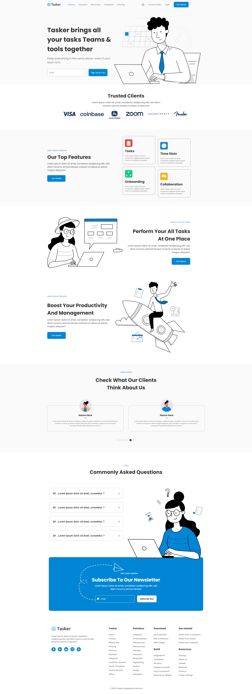

# Tasker

## Welcome! 👋

Nice to see you in my humble thresholds again !

I present my third version of a coded page using a free project using the Figma tool.
I tried to work out even the smallest details. The "basic" languages such as HTML, CSS(SCSS) and JS were used to create this site. I also used [SwiperJS](https://swiperjs.com/) to create a carousel in the section with "Testimonials".

I modeled after a project available for free which was designed in figma ;)
The graphic design is not mine - I only coded it for research purposes.
[Uikitfree](https://uikitfree.com/)

LIVE: https://xbuzax.github.io/Tasker/